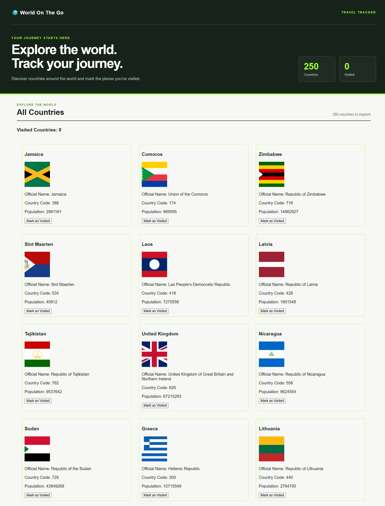
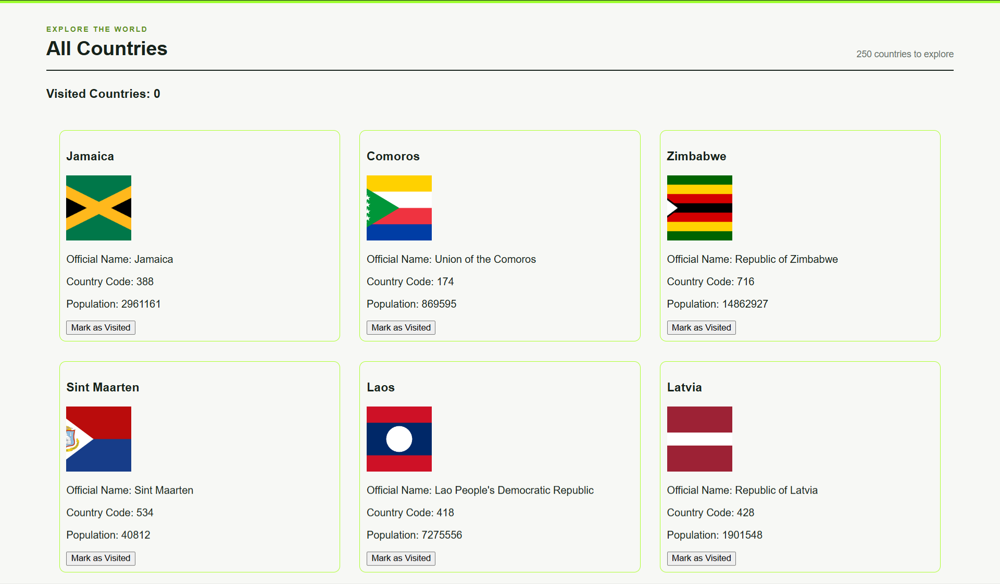
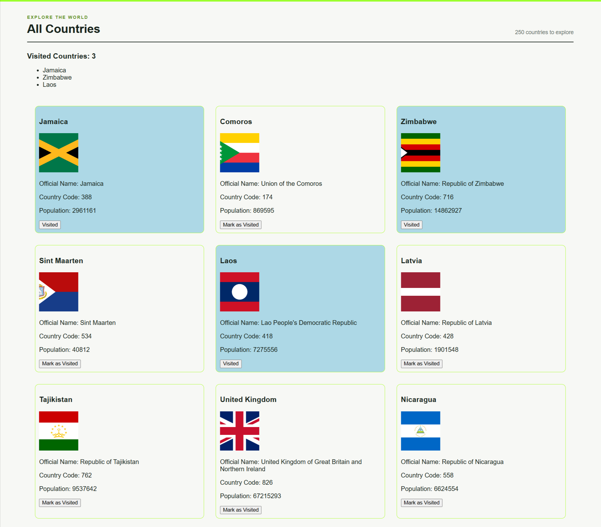
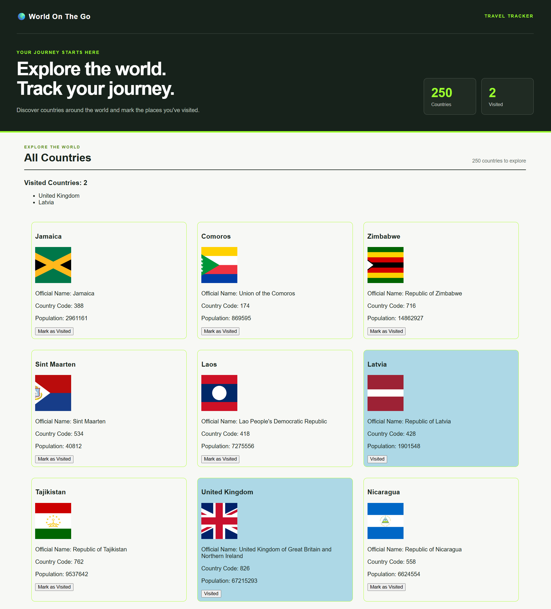
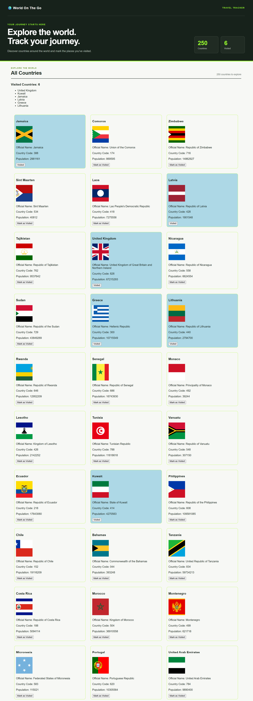
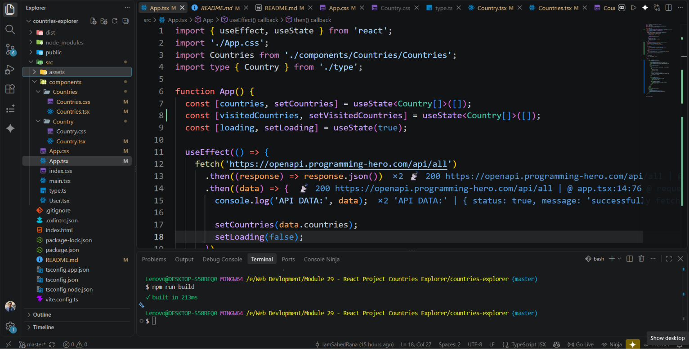

# Countries Explorer - Country Tracking Web Application

**Countries Explorer** is a React and TypeScript web application that allows users to explore different countries, view country information and flags, and mark countries as visited.

The goal of this project was to practice building an interactive React application while improving my understanding of TypeScript, components, props, state management, API data, and React Hooks.

## 🌐 Live Demo

🔗 **Netlify:**  
https://countries-explorer-iamsahedrana.netlify.app/

# Features

- Country Information Display
- Country Flags
- API Data Fetching
- Visited Country Tracking
- Toggle Visited / Unvisited Status
- Visited Countries Count
- Loading State
- React Components
- TypeScript Type Safety
- State Management
- Interactive UI
- Clean User Interface

# Technologies Used

- React
- TypeScript
- Vite
- CSS3
- REST API
- Fetch API
- React Hooks
- useState
- useEffect
- Git & GitHub
- Netlify


# 📷 Project Sections

# 1. Countries Display

> Screenshot: `./Preview/Countries.png`



### Description

The main section displays a collection of countries retrieved from an external API.

Each country is presented using a reusable React component.

Features include:

- Country flag
- Country name
- Country information
- Country card
- Visit button
- Interactive country status
- Clean card layout


# 2. Country Card

> Screenshot: `./Preview/Country-Card.png`



### Description

Each country is displayed inside a reusable country card component.

The country card receives country information through React props and displays the relevant information to the user.

Each card contains:

- Country flag
- Country name
- Country details
- Visited status
- Visit toggle button

React concepts used:

- Components
- Props
- TypeScript interfaces
- Event handling
- Conditional rendering
- Component reusability


# 3. Visited Country Feature

> Screenshot: `./Preview/Visited-Country.png`



### Description

The visited country feature allows users to mark a country as visited.

When the user clicks the visit button, the country's status is updated and the interface immediately reflects the change.

Users can also toggle the country back to its unvisited state.

Features include:

- Mark country as visited
- Toggle visited status
- Interactive button
- Dynamic UI updates
- State-based rendering

React concepts used:

- `useState`
- Event handlers
- Props
- State updates
- Conditional rendering
- Array methods


# 4. Visited Countries Count

> Screenshot: `./Preview/Visited-Count.png`



### Description

The application keeps track of the total number of countries that have been visited.

The count automatically updates whenever a country is marked as visited or changed back to unvisited.

Features include:

- Dynamic visited count
- Automatic UI updates
- State-driven data
- Real-time count calculation

This section helped me understand how React state flows through components and how changes in state automatically trigger UI updates.


# 5. API Data Loading

> Screenshot: `./Preview/API-Data.png`



### Description

Country information is loaded from an external API.

The application handles the asynchronous data-loading process and displays the country information after the API request is completed.

Features include:

- API integration
- Fetching country data
- Promise handling
- Loading state
- Dynamic data rendering
- Error-aware data flow

React and JavaScript concepts used:

- `fetch()`
- Promises
- `useEffect`
- `useState`
- Async data handling
- Array methods


# 🎨 Design Highlights

- Clean country card layout
- Simple and readable interface
- Flag-focused visual design
- Consistent spacing
- Interactive buttons
- Clear visited status
- Component-based UI
- Simple typography
- User-friendly interface


# 📚 What I Practiced

While building this project I practiced:

- React Components
- TypeScript
- TypeScript Interfaces
- Type Aliases
- Props
- State
- `useState`
- `useEffect`
- Event Handling
- Conditional Rendering
- API Integration
- Fetch API
- Promises
- Loading States
- Array `map()`
- Array `filter()`
- State Updates
- Data Flow Between Components
- Component Reusability
- Type-safe React Development


# 6. Project Structure

> Screenshot: `./Preview/Project-Structure.png`



### Description

The project is organized into reusable React components to keep the application clean and easier to maintain.

The main application manages the country data and state, while individual components are responsible for displaying the countries and country cards.

The project structure includes:

- React components
- TypeScript type definitions
- CSS files
- Main application file
- Vite configuration
- Public assets

# 📂 Project Structure

```text
COUNTRIES-EXPLORER/
│
├── public/
│
├── src/
│   │
│   ├── components/
│   │   │
│   │   ├── Countries/
│   │   │   ├── Country/
│   │   │   └── ...
│   │
│   ├── App.tsx
│   ├── App.css
│   ├── type.ts
│   └── main.tsx
│
├── index.html
├── package.json
├── package-lock.json
├── tsconfig.json
├── vite.config.ts
└── README.md